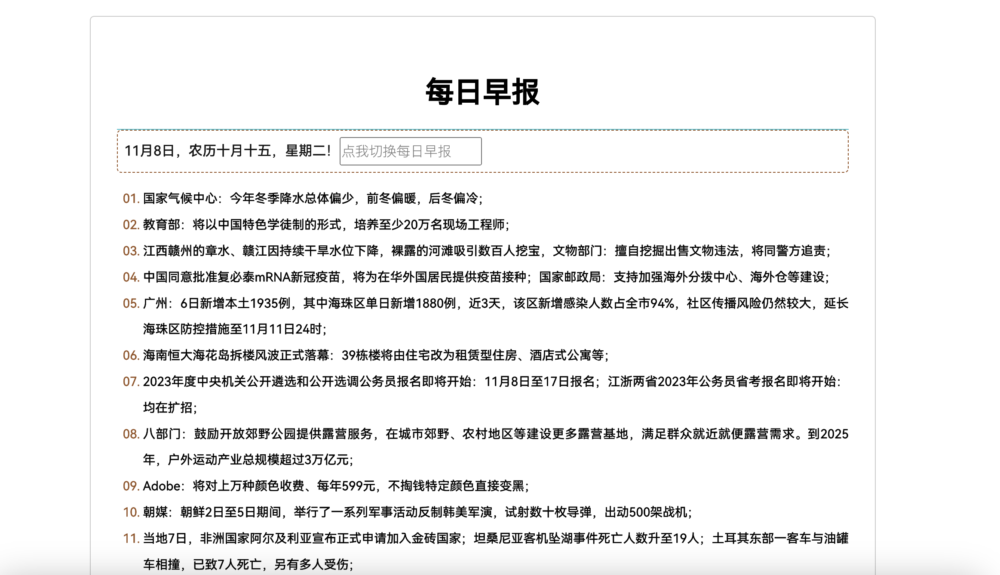

# 每日早报

#### 项目起因

- 经常在各种地方看到 `每日60s读懂世界`

- 感觉很不错，就想着能不能自己做一个

- 基于github.com/zkeq/news项目 

- 使用Go写了个差不多的 可切换日期
#### 项目技术栈
- Go1.19.3
- GoWeb 原生Http库
- 第三方Api在下方
### 图片

#### zkeq/news官网

- 官网地址：[https://news.icodeq.com](https://news.icodeq.com/)
- 源码地址：https://github.com/zkeq/news

#### API 说明

GET：`/api`

##### 请求参数

| 参数名           | 位置  | 类型   | 必填 | 示例值 |说明  |
| :--------------- | :---- | :----- | :--: | :--------------------- | :--------------------- |
| `_vercel_no_cache` | `query` |        |  否  | `1` |说明：`vercel` 强制不缓存                            |
| `cache`          | `query` |        |  否  | 任意值  |说明：清除缓存用                              |
| `index`          | `query` | `number` |  否  | `0` | 说明：`0-99` 用来控制天数，`0` 为今天，`1` 为昨天，依次类推 |
| `origin`         | `query` | `string` |  否  | `zhihu` |说明："`zhihu`" 或 "`163`" 切换源                  |

详细信息见：[每日早报 (apifox.cn)](https://www.apifox.cn/apidoc/shared-4c5d28ed-633e-45e0-a6d5-3c0a8933f132/api-28569354)